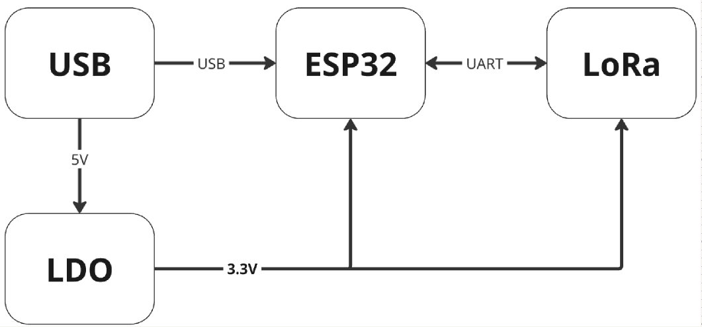
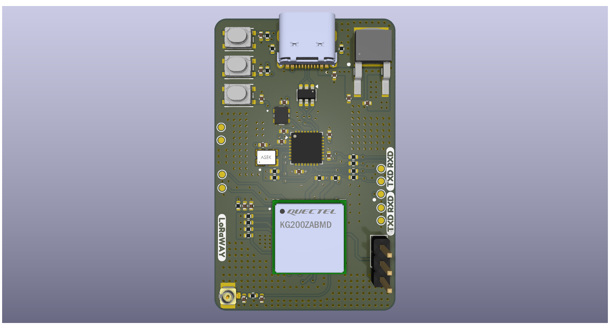

# LoRa P2P
# Author: Vladimir Jovičić

## Overview

This project provides a robust solution for long-range wireless communication utilizing LoRa (Long Range) technology. The primary objective was to establish a direct P2P (Point-to-Point) link between two devices to facilitate data exchange without the need for centralized network infrastructure.

The system is built around the **ESP32-C3** microcontroller, which manages system logic, and the **Quectel KG200Z** communication module, which handles RF transmission. The hardware covers the complete signal path — from USB power regulation and stabilization to processing and antenna output.

---

## LoRa RF Configuration

Both the transmitter and receiver share identical RF parameters to ensure successful communication:

| Parameter | Value |
|---|---|
| Frequency | 868 MHz (EU868 band) |
| TX Power | 14 dBm |
| Bandwidth | 125 kHz (BW = 4) |
| Spreading Factor | SF12 (maximum range, minimum speed) |
| Coding Rate | 4/5 (CR = 1) |
| Payload Length | 16 bytes (fixed) |

---

## Hardware Overview

| Component | Details |
|---|---|
| Microcontroller | ESP32-C3 |
| LoRa Module | Quectel KG200Z |
| Power Management | USB Type-C input (VBUS) regulated to +3.3V via AP7363 LDO |
| ESD Protection | USBLCS-25C6 on USB data lines |
| Oscillators | 32.768 kHz and 40 MHz for ESP32-C3 |
| Boot Control | Hardware buttons for RST and Boot mode (MCU + LoRa module) |
| Communication | UART between ESP32-C3 and KG200Z (GPIO14 TX, GPIO15 RX) |
| Power Consumption | ESP32-C3 up to 50 mA; KG200Z up to 120 mA during TX at 20 dBm |

---

## Schematic Overview

---
## 3D view of (PCB)

---

> **Note:** SF12 on 125 kHz BW offers the longest possible range but the lowest data rate. This is well suited for infrequent sensor transmissions over long distances.

---

## Software Overview

The firmware is written in C for the ESP-IDF (FreeRTOS-based) framework. Both the transmitter and receiver control the KG200Z module via AT commands over UART.

---

## Transmitter Firmware

**File:** `lora_tx_main.c`

### Behaviour

The transmitter wakes up from deep sleep every **24 hours**, sends one sensor data packet over LoRa, then returns to sleep. An RTC-backed counter tracks wake events, successful transmissions, and errors across sleep cycles.

### Execution Flow

### Key Functions

#### `uart_init()`
Initializes UART1 at 115200 baud, 8N1, no flow control, with a 2048-byte RX buffer. TX pin is GPIO14, RX pin is GPIO15.

#### `send_at_command(cmd, timeout_ms)`
Sends an AT command with `\r\n` terminator and reads the response byte-by-byte until one of the following is detected:
- `OK` → returns `true`
- `ERROR` / `PARAM_ERROR` / `BUSY_ERROR` → returns `false`
- Timeout expires → returns `false`

Two timeout tiers are used:

| Constant | Value | Used for |
|---|---|---|
| `TIMEOUT_SHORT_MS` | 2000 ms | Commands that respond immediately |
| `TIMEOUT_LONG_MS` | 8000 ms | `AT+QTTX=1`, waits for physical TX |

#### `lora_p2p_init()`
Configures the KG200Z for P2P mode in three steps:
1. `ATQ` — module check (up to 3 retries)
2. `AT+QP2P=1` — enable P2P mode
3. `AT+QTCONF=868000000:14:4:12:1:0:0:1:16:25000:2:3` — set RF parameters

#### `send_sensor_data()`
Generates simulated sensor readings (temperature: -30°C to +50°C, humidity: 0–100%), formats the payload as `T:<val>C,H:<val>%`, then:
1. `AT+QTDA=<payload>` — loads data into the module TX buffer
2. `AT+QTTX=1` — triggers RF transmission

#### `go_to_sleep()`
Shuts down the LoRa module (`AT+QP2P=0`), logs session statistics, flushes UART, and calls `esp_deep_sleep_start()` with a **24-hour** wakeup timer.

### RTC-Persistent Statistics

Stored in `RTC_DATA_ATTR` — these values survive deep sleep:

| Variable | Description |
|---|---|
| `wake_count` | Total number of wakeups |
| `total_sent` | Successfully transmitted packets |
| `total_errors` | Failed transmission attempts |

---

## Receiver Firmware

**File:** `lora_rx_main.c`

### Behaviour

The receiver runs continuously in a loop, listening for incoming LoRa packets using a **20-second RX window** per cycle, followed by a 500 ms pause. It parses received packets and logs signal quality (RSSI, SNR).

### Execution Flow

### Key Functions

#### `uart_init()`
Identical UART1 configuration to the transmitter (115 200 baud, 8N1, GPIO14/15).

#### `send_at_command(cmd, timeout_ms)`
Same implementation as the transmitter, with additional `ESP_LOGI` logging of sent commands and received OK/ERROR responses.

#### `lora_p2p_init()`
Same three-step initialization as the transmitter. RF parameters **must match** the transmitter exactly for successful reception.

#### `wait_for_packet()`
Sends `AT+QTRX=1` and reads the module response for up to `RX_WINDOW_MS` (20 seconds):

| Condition | Action |
|---|---|
| `"buf: "` in response | Packet physically received; sets `received = true` |
| `"OK"` in response | End of module response; exits loop |
| `"ERROR"` in response | Increments `rx_errors`; returns `false` |
| Timeout | Logs idle state; increments `timeout_count` |

#### `parse_rx_data(rx_buf)`
Parses the module's RX response string and extracts:
- **Payload** — substring after `"buf: "` up to `\r` or `\n`
- **RSSI** — integer value after `"RssiValue="`
- **SNR** — integer value after `"SnrValue="`

### Runtime Statistics (RAM only)

| Variable | Description |
|---|---|
| `packets_received` | Total successfully received packets |
| `timeout_count` | Number of RX windows with no packet |
| `rx_errors` | Number of command errors |

---

## AT Command Reference

| Command | Used By | Purpose |
|---|---|---|
| `ATQ` | TX / RX | Module health check |
| `AT+QP2P=1` | TX / RX | Enable P2P mode |
| `AT+QP2P=0` | TX | Disable P2P mode before sleep |
| `AT+QTCONF=...` | TX / RX | Set RF parameters |
| `AT+QTDA=<data>` | TX | Load payload into TX buffer |
| `AT+QTTX=1` | TX | Trigger LoRa transmission |
| `AT+QTRX=1` | RX | Open RX window (wait for 1 packet) |

---

## Buffer and Timeout Constants

| Constant | Value | Description |
|---|---|---|
| `RX_BUF_SIZE` | 1024 B | UART RX buffer |
| `CMD_BUF_SIZE` | 128 B | AT command string buffer |
| `DATA_BUF_SIZE` | 64 B | Sensor payload buffer |
| `PACKET_BUF_SIZE` | 512 B | Full RX packet buffer (RX only) |
| `TIMEOUT_SHORT_MS` | 2000 ms | Short AT command timeout |
| `TIMEOUT_LONG_MS` | 8000 ms | Long timeout for `AT+QTTX` |
| `RX_WINDOW_MS` | 20000 ms | RX listen window per cycle |
| `PAUSE_BETWEEN_RX_MS` | 500 ms | Pause between RX cycles |
| `WAIT_AFTER_TX_MS` | 3000 ms | Wait after TX before sleep |
| `SLEEP_DURATION_US` | 86 400 000 000 µs | Deep sleep duration (24 h) |

---

## Power Strategy

The transmitter leverages the ESP32-C3 deep sleep to minimize average current consumption. Only the RTC domain remains powered during sleep, preserving the counters stored in `RTC_DATA_ATTR` variables.

The receiver operates in continuous active mode, as it must always be ready to receive incoming transmissions.

---

